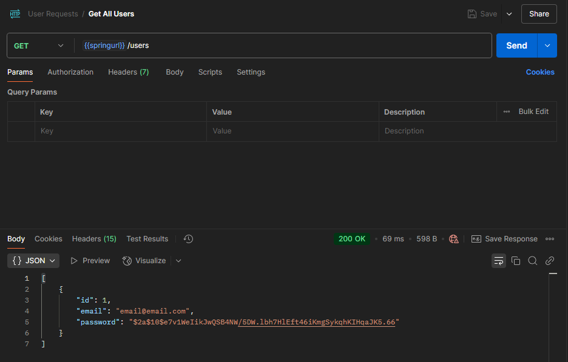
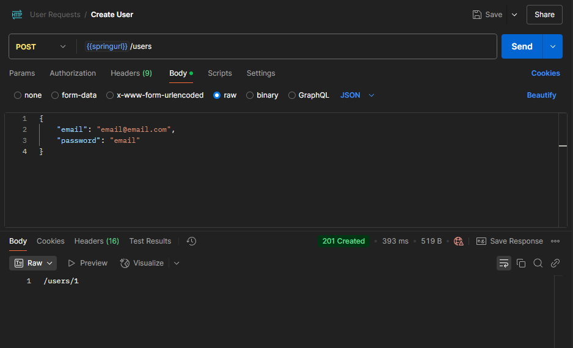
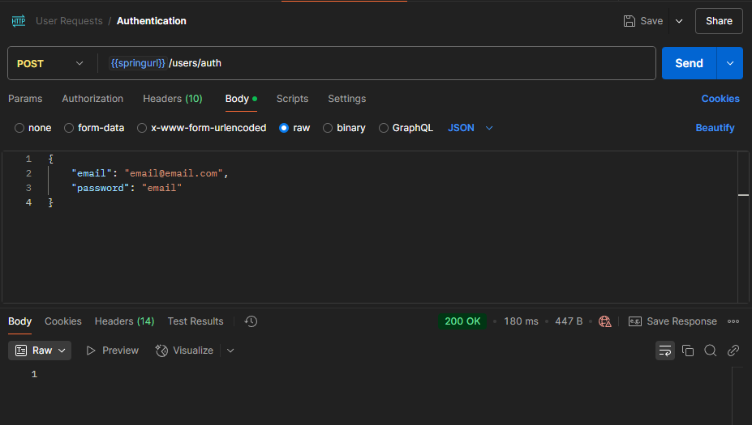
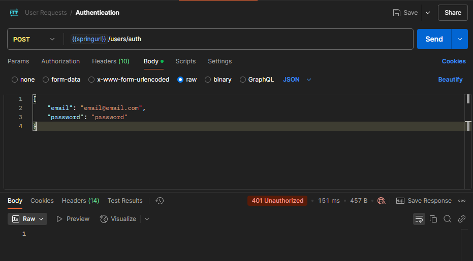
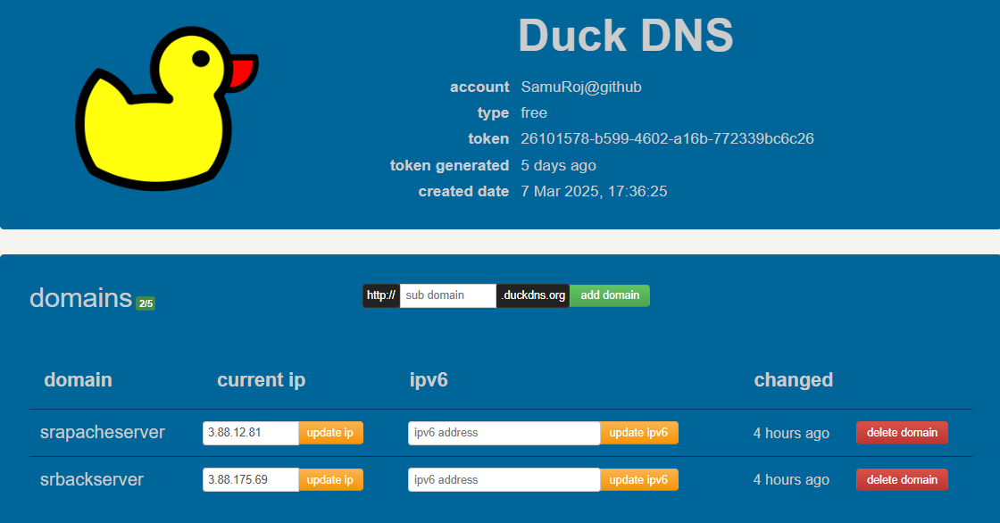
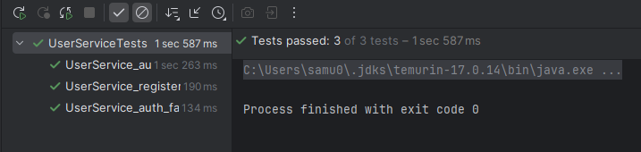

# Secure Application Design

This project is a simple CRUD system for managing real estate properties. It has a basic web application that 
allows users to manage property listings, a secure design to ensure integrity and confidentiality and a scalable 
application by using AWS infrastructure. 

The architecture has three primary components:

- **Server 1:** Apache server that serves an asynchronous HTML + JavaScript client over a secure connection using 
TLS. Client-side code will be delivered through encrypted channels, ensuring data integrity and confidentiality.

- **Server 2:** Spring Framework
The Spring server will handle backend services, offering RESTful API endpoints. These services will also be 
protected using TLS, ensuring secure communication between the client and the backend.

- **Server 3:** MySql
The MySql server will receive the petitions from the backend and store them in a database to persist the received
data.

## Getting Started

### Prerequisites

### 1. **Java Development Kit (JDK)**

- To check if Java is installed, run:

```
java -version
```

- If Java is not installed, download it from the official Oracle [website](https://www.oracle.com/co/java/technologies/downloads/).

### 2. **Maven**

- To check if Maven is installed, run:

```
mvn --version
```

- If Maven is not installed, download it from the official Apache Maven [website](https://maven.apache.org/download.cgi).

### 3. Git

- To check if Git is installed, run:

```
git --version
```

- If Git is not installed, download it from the official Git [website](https://git-scm.com/downloads).

### 4. Docker

- To check if Docker is installed, run:

```
docker --version
```

- If Docker is not installed, download it from the official Docker [website](https://www.docker.com/products/docker-desktop/).

### Installing and deploying locally

1. Clone the repository to your local machine using Git.

```
git clone https://github.com/SamuRoj/AREP_Taller_6.git
```

2. Navigate to the project directory.

```
cd AREP_Taller_6
```

3. Run a container with a mysql image, it can be done with the following command and wait for it to be completely 
deployed.

```
docker run --name mysqlpropertydb -e MYSQL_ROOT_PASSWORD=secretProperty -e MYSQL_DATABASE=properties -e MYSQL_USER=userProperty -e MYSQL_PASSWORD=secretProperty -p 3306:3306 -d mysql:latest
```

4. Once the container is completely running, execute the next command:

```
mvn spring-boot:run
```

5. Once the application is running, open your web browser and visit:

```
https://localhost:8080/index.html
```

## Features of the application

**Note:** {springurl} represents the following string "https://localhost:8080"

**Get all properties:** Retrieves all properties stored in the database.

**Endpoint:** GET /properties


**Get property by id:** Retrieves a specific property by its ID. 

**Endpoint:** GET /properties/{id}


**Filter property by address:** Returns properties that match the given address.

**Endpoint:** GET /properties/address?address=


**Filter property by price:** Returns properties that match the given price.

**Endpoint:** GET /properties/price?price=


**Filter property by size:** Returns properties that match the given size.

**Endpoint:** GET /properties/size?size=


**Create a property:** Adds a new property to the database.

**Endpoint:** POST /properties


**Update a property:** Updates an existing property’s details.

**Endpoint:** PUT /properties/{id}


**Delete a property:** Deletes a property from the database.

**Endpoint:** DELETE /properties/{id}


**Get all users:** Retrieves all the users from the database.

**Endpoint:** GET /users



**Create User:** Creates a new user in the database.

**Endpoint:** POST /users



**Create User:** Verifies the credentials of the user to approve his access to the app.

**Endpoint:** POST /users/auth





## Architecture

### Project Structure

```
├───main
│   ├───java
│   │   └───eci
│   │       └───arep
│   │           └───property
│   │               │   PropertyApplication.java # Runs the app through the port 8080
│   │               │
│   │               ├───config # Configures the app to receives cross origin requests
│   │               │       SecurityConfig.java
│   │               │
│   │               ├───controller # Handles the request from the clients to the endpoints
│   │               │       PropertyController.java
│   │               │       UserController.java
│   │               │
│   │               ├───dto # Maps the values of the user into a data transfer object
│   │               │       PropertyDto.java
│   │               │       UserDto.java
│   │               │
│   │               ├───exception # Custom exception to handle errors
│   │               │       PropertyNotFound.java
│   │               │
│   │               ├───model # Entities being used at the database
│   │               │       Property.java
│   │               │       UserEntity.java
│   │               │
│   │               ├───repository # Communicates the app with the database
│   │               │       PropertyRepository.java
│   │               │       UserRepository.java
│   │               │
│   │               └───service # Logic of each endpoint
│   │                       PropertyService.java
│   │                       UserService.java
│   │
│   └───resources # Setup of the application
│       │   application.properties
│       │
│       ├───img # Images used in the README
│       │       After_Delete.png
│       │       ClassDiagram.png
│       │       Create_Property.png
│       │       Delete_Property.png
│       │       DeploymentDiagram.png
│       │       Filter_By_Address.png
│       │       Filter_By_Price.png
│       │       Filter_By_Size.png
│       │       Get_All_Properties.png
│       │       Get_Property_By_Id.png
│       │       PropertyServiceTests.png
│       │       Update_Property.png
│       │
│       ├───keystore # Keys and certificate used for the https connection
│       │       srpropcert.cer
│       │       srpropkeystore.p12
│       │
│       ├───static # Static files that will be served to the user through the Apache Server. 
│       │   │   index.html
│       │   │   properties.html
│       │   │   register.html
│       │   │
│       │   ├───css
│       │   │       index.css
│       │   │       login.css
│       │   │       register.css
│       │   │
│       │   └───js 
│       │           api.js
│       │           login.js
│       │           properties.js
│       │           register.js
│       │
│       ├───truststore
│       │       myTrustStore
│       │
│       └───vid # Videos used in the README
│
└───test
    └───java
        └───eci
            └───arep
                └───property
                    │   PropertyApplicationTests.java
                    │
                    └───service # Unit tests for the services
                            PropertyServiceTests.java
                            UserServiceTests.java
```

### Class Diagram


### Classes

* **PropertyApplication:** A class that initiates and sets up the entire application. 
* **PropertyController:** Application that handles incoming requests related to real estate properties. Acts as an 
interface between the client and the backend logic. 
* **UserController:** Application that handles incoming requests related to the users.
* **PropertyDto:** It's used to transfer property data between the layers of the application, in this case the controller,
service and model.
* **UserDto:** It's used to transfer user data between the layers of the application.
* **PropertyNotFound:** Exception showing that the requested property could not be found in the database.
* **Property:** Entity that represents a real-world property with some of his features like the address, price, size and
description inside the application.
* **UserEntity:** Entity that represents a real user with some features like the email and password.
* **PropertyRepository:** Component responsible for managing the data access layer related to properties, handles database
operations. 
* **UserRepository:** Component responsible for managing the data access layer related to users.
* **PropertyService:** Contains the business logic related to properties. It acts as an intermediary between the 
controller and the repository.
* **UserService:** Contains the business logic related to users and hashes the passwords for security.

### Deployment Diagram


* **EC2 Instances:** Virtual servers provided by Amazon Web Services (AWS) that allow you to run applications and services
in the cloud.
* **Docker Engine:** Software platform that enables developers to build, deploy and run applications inside containers.
* **MySql Container:** Instance of the MySQL database management system, deployed with Docker.
* **Backend Server:** Server with the main application that handles the server-side logic data processing for 
the property listings and user management and handles basic security of the app.
* **Apache Server:** Server that answers requests related to the static files of the app.
* **HTML, CSS and JS:** Files required to render the webpage in the client browser. 

## AWS Deployment

### DuckDNS

1. Create a domain with DuckDNS to be able to generate a certificate with Let's Encrypt, just put the IP of the 
Amazon EC2 instance. 



### Obtaining SSL Certificate with Certbot and Exporting to PKCS12 Format

1. Install Certbot

```
sudo yum install certbot -y
```

2. Obtain SSL certificate with Certbot

```
sudo certbot certonly --standalone -d <domain>
```

3. Export certificate to PKCS12 format, which is commonly used in Java-based applications.

```
sudo openssl pkcs12 -export \
    -in /etc/letsencrypt/live/<domain>/fullchain.pem \
    -inkey /etc/letsencrypt/live/<domain>/privkey.pem \
    -out <keyname>.p12 \
    -name <alias> \
    -CAfile /etc/letsencrypt/live/<domain>/chain.pem \
    -caname "Let's Encrypt"
```

5. Import the keystore into the application, make it by modifying the file application.properties

```
server.ssl.key-store=classpath:<keyname>.p12
server.ssl.key-store-password=<password>
server.ssl.key-store-type=PKCS12
server.ssl.key-alias=<alias>
server.ssl.enabled=true
```

### Installation of servers

- **Apache Server:**

1. Install apache (httpd)

```
sudo yum install httpd
```

2. Start apache
```
sudo systemctl start httpd
```

3. Enable apache to start on boot

```
sudo systemctl enable httpd
```

4. Check the status of apache

```
sudo systemctl status httpd
```

5. Change ownership of the web directory and transfer the static files of the application to the folder 
/var/www/html through SFTP

```
sudo chown <user>:<group> /var/www/html
```

6. Now, install Certbot to generate a certificate and a https connection to the application.

```
sudo yum install certbot
```

7. Obtain SSL certificate from Let’s Encrypt, through Certbot, answer the questions about domain, email, etc. 

```
sudo certbot certonly
```

8. Change ownership of apache configuration files, to enable SSL and https connection.

```
sudo chown <user>:<group> -R /etc/httpd/conf.d
```

9. Install SSL module for apache.

```
sudo yum install -y mod_ssl
```

10. Create or modify the apache virtual host configuration to enable SSL. Add the following block to the file
/etc/httpd/conf.d/ssl.conf. 

```
<VirtualHost *:443>
    ServerName <domain>
    DocumentRoot /var/www/html

    SSLEngine on
    SSLCertificateFile /etc/letsencrypt/live/<domain>/fullchain.pem
    SSLCertificateKeyFile /etc/letsencrypt/live/<domain>/privkey.pem

    <Directory /var/www/html>
        AllowOverride All
        Require all granted
    </Directory>
</VirtualHost>
```

11. Restart apache to apply changes and navigate to your domain to see the https connection. Also, ensure that 
port 443 is open to receive https connections.

```
sudo systemctl restart httpd
```

12. Access the application through the following link:

```
https://<your-front-domain>
```

- **Application Server (Spring):**

1. Install Java 17

```
sudo yum install java-17-amazon-corretto-devel -y
```

2. Install Maven

```
sudo yum install maven -y
```

3. Install Git

```
sudo yum install git -y
```

4. Clone the Spring project repository

```
git clone https://github.com/SamuRoj/AREP_Taller_6.git
```

5. Navigate to the project directory

```
cd AREP_Taller_6
```

6. Modify some project files with the URL of your domain, the files to modify are SecurityConfig, User and Property
Controller and application.properties (Database connection)

```
nano src/main/java/com/example/YourClass.java
```

7. Build the Spring project with Maven

```
mvn clean install
```

8. Run the application

```
mvn spring-boot:run
```

- **MySql Server:**

1. Update the system packages

```
sudo yum update -y
```

2. Install docker

```
sudo yum install docker
```

3. Start the docker service

```
sudo service docker start
```

4. Add the current user to docker group

```
sudo usermod -a -G docker <user>
```

5. Run MySQL in a docker container, this will create a new database where the users and properties will be stored.

```
docker run --name mysqlpropertydb -e MYSQL_ROOT_PASSWORD=secretProperty -e MYSQL_DATABASE=properties -e MYSQL_USER=userProperty -e MYSQL_PASSWORD=secretProperty -p 3306:3306 -d mysql:latest
```

6. Verify MySQL container is running

```
docker ps 
```

### Creation example of an Amazon EC2 instance


### Local Deployment


### Video with AWS Deployment working


## Running the tests

**Note:** To execute them properly run a container with a mysql image  locally, it  can be done with the following 
command:

```
docker run --name mysqlpropertydb -e MYSQL_ROOT_PASSWORD=secretProperty -e MYSQL_DATABASE=properties -e MYSQL_USER=userProperty -e MYSQL_PASSWORD=secretProperty -p 3306:3306 -d mysql:latest
```

- Execute the tests by running the following command:

```
mvn test
```

### PropertyServiceTests

The tests in this file check the functionality of the logic within the service class. 

- Image of the results:

  

### UserServiceTests

The tests in this file check the functionality of the logic within the user service class.

- Image of the results:

  

## Built With

* [Java Development Kit](https://www.oracle.com/co/java/technologies/downloads/) - Software Toolkit
* [Maven](https://maven.apache.org/) - Dependency Management
* [Docker](https://www.docker.com/) - Platform for building, running, and managing containerized applications
* [AWS](https://aws.amazon.com/es/) - Cloud computing platform for hosting, storage, and computing services
* [Git](https://git-scm.com/) - Distributed Version Control System

## Authors

* **Samuel Rojas** - [SamuRoj](https://github.com/SamuRoj)

## License

This project is licensed under the GNU License - see the [LICENSE.txt](LICENSE.txt) file for details.
