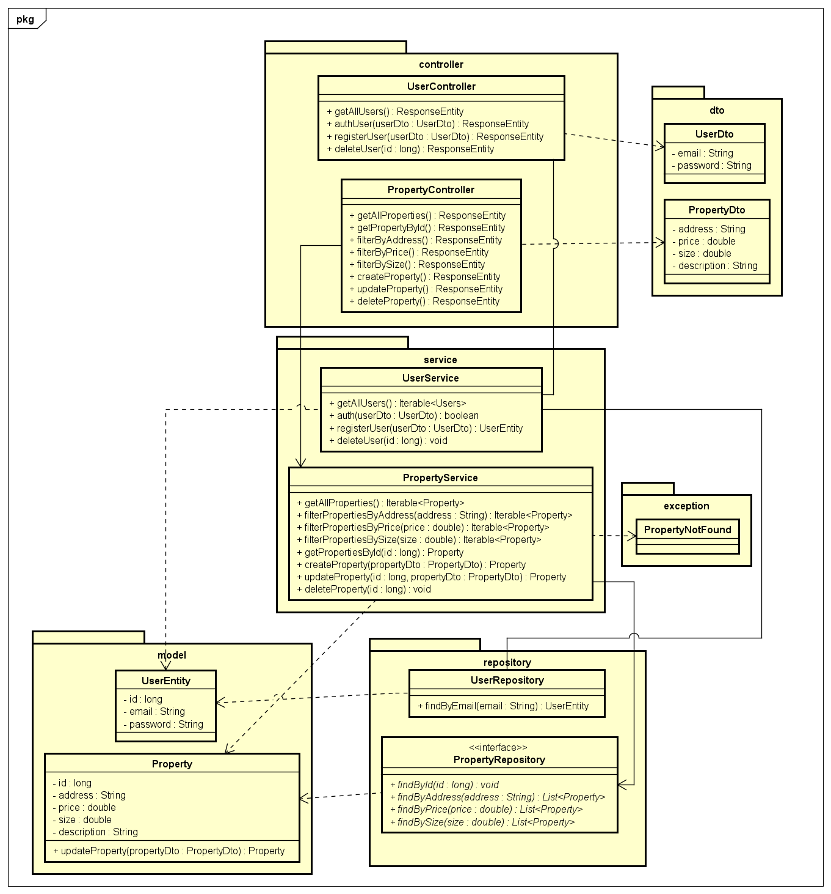

# Architectural Patterns

This project is a simple CRUD  system for managing real estate properties. It has a basic web application that 
allows users to perform the following operations on property listings:

- Create new property listing.
- Read or view a list of all properties and individual property details.
- Update existing property details.
- Delete property listings.

It has a frontend built with HTML and JavaScript, a REST API backend made with Spring Boot and a database in 
MySql. The backend and the database had been deployed into AWS EC2 instances for the deployment on the cloud.

## Getting Started

### Prerequisites

### 1. **Java Development Kit (JDK)**

- To check if Java is installed, run:

```
java -version
```

- If Java is not installed, download it from the official Oracle [website](https://www.oracle.com/co/java/technologies/downloads/).

### 2. **Maven**

- To check if Maven is installed, run:

```
mvn --version
```

- If Maven is not installed, download it from the official Apache Maven [website](https://maven.apache.org/download.cgi).

### 3. Git

- To check if Git is installed, run:

```
git --version
```

- If Git is not installed, download it from the official Git [website](https://git-scm.com/downloads).

### 4. Docker

- To check if Docker is installed, run:

```
docker --version
```

- If Docker is not installed, download it from the official Docker [website](https://www.docker.com/products/docker-desktop/).

### Installing and deploying locally

1. Clone the repository to your local machine using Git.

```
git clone https://github.com/SamuRoj/AREP_Taller_5.git
```

2. Navigate to the project directory.

```
cd AREP_Taller_5
```

3. Run a container with a mysql image, it can be done with the following command and wait for it to be completely 
deployed.

```
docker run --name mysqlpropertydb -e MYSQL_ROOT_PASSWORD=secretProperty -e MYSQL_DATABASE=properties -e MYSQL_USER=userProperty -e MYSQL_PASSWORD=secretProperty -p 3306:3306 -d mysql:latest
```

4. Once the container is completely running, execute the next command:

```
mvn spring-boot:run
```

5. Once the application is running, open your web browser and visit:

```
http://localhost:8080/index.html
```

## Features of the application

**Note:** {springurl} represents the following string "http://localhost:8080"

**Get all properties:** Retrieves all properties stored in the database.

**Endpoint:** GET /properties


**Get property by id:** Retrieves a specific property by its ID. 

**Endpoint:** GET /properties/{id}


**Filter property by address:** Returns properties that match the given address.

**Endpoint:** GET /properties/address?address=


**Filter property by price:** Returns properties that match the given price.

**Endpoint:** GET /properties/price?price=


**Filter property by size:** Returns properties that match the given size.

**Endpoint:** GET /properties/size?size=


**Create a property:** Adds a new property to the database.

**Endpoint:** POST /properties


**Update a property:** Updates an existing property’s details.

**Endpoint:** PUT /properties/{id}


**Delete a property:** Deletes a property from the database.

**Endpoint:** DELETE /properties/{id}


## Architecture

### Project Structure

```
├───main
│   ├───java
│   │   └───eci
│   │       └───arep
│   │           └───property
│   │               │   PropertyApplication.java # Runs the app through the port 8080
│   │               │
│   │               ├───controller # Handles the request from the clients to the endpoints
│   │               │       PropertyController.java
│   │               │
│   │               ├───dto # Maps the values of the user into a data transfer object
│   │               │       PropertyDto.java
│   │               │
│   │               ├───exception # Custom exception to handle errors
│   │               │       PropertyNotFound.java
│   │               │
│   │               ├───model # Entity being used at the database
│   │               │       Property.java
│   │               │
│   │               ├───repository # Communicates the app with the database
│   │               │       PropertyRepository.java
│   │               │
│   │               └───service # Logic of each endpoint
│   │                       PropertyService.java
│   │
│   └───resources 
│       │   application.properties # Setup of the application
│       │
│       ├───img # Images used in the README
│       │       After_Delete.png
│       │       ClassDiagram.png
│       │       Create_Property.png
│       │       Delete_Property.png
│       │       DeploymentDiagram.png
│       │       Filter_By_Address.png
│       │       Filter_By_Price.png
│       │       Filter_By_Size.png
│       │       Get_All_Properties.png
│       │       Get_Property_By_Id.png
│       │       PropertyServiceTests.png
│       │       Update_Property.png
│       │
│       ├───static # Static files that will be served to the user. 
│       │       api.js
│       │       index.html
│       │       script.js
│       │       styles.css
│       │
│       └───vid # Videos used in the README
│               AWS_Test.gif
│               Docker_Hub_Upload.gif
│               Local_Demo.gif
│               mysql_AWS.gif
│
└───test
    └───java
        └───eci
            └───arep
                └───property
                    │   PropertyApplicationTests.java
                    │
                    └───service # Unit tests for the service
                            PropertyServiceTests.java
```

### Class Diagram



### Classes

* **PropertyApplication:** A class that initiates and sets up the entire application. 
* **PropertyController:** Application that handles incoming requests related to real estate properties. Acts as an 
interface between the client and the backend logic. 
* **PropertyDto:** It's used to transfer property data between layers of an application, in this case the controller, the
service and the model.
* **PropertyNotFound:** Exception showing that the requested property could not be found in the database.
* **Property:** Entity that represents a real-world property with some of his features like the address, price, size and
description inside the application.
* **PropertyRepository:** Component responsible for managing the data access layer related to properties, handles database
operations. 
* **PropertyService:** Contains the business logic related to properties. It acts as an intermediary between the 
controller and the repository.

### Deployment Diagram


* **EC2 Instances:** Virtual servers provided by Amazon Web Services (AWS) that allow you to run applications and services
in the cloud.
* **Docker Engine:** Software platform that enables developers to build, deploy and run applications inside containers.
* **MySql Container:** Instance of the MySQL database management system, deployed with Docker.
* **Backend Container:** Container with the main application that handles the server-side logic and data processing for 
the property listings.
* **HTML, CSS and JS:** Files required to render the webpage in the client browser. 

## Docker and AWS Deployment

### Video of local deployment

Demo that shows the app running locally.


### Video with Dockerhub and AWS deployment working

This is a demo that shows the deployment of the image on DockerHub, the virtual machine used in AWS, the creation
of the container and the access to the server through the virtual machine showing all the features included in the
web application.

1. Video of the creation of an Amazon EC2 instance and a MySql container, commands used:

```
sudo yum update -y
sudo yum install docker
sudo service docker start
sudo usermod -a -G docker ec2-user
docker run --name mysqlpropertydb -e MYSQL_ROOT_PASSWORD=secretProperty -e MYSQL_DATABASE=properties -e MYSQL_USER=userProperty -e MYSQL_PASSWORD=secretProperty -p 3306:3306 -d mysql:latest
```


2. Uploading the local image to Docker.

**Note:** The steps in this video just work when the local instance is connected properly to the Amazon Ec2 instance
with the mysql image. 


3. Testing the functionality of the app in two Amazon EC2 instances, one for the backend and the other for the
database. 

```
docker run -d -p 8080:8080 --name propertiesapp samuroj/springdbtaller5
```

**Note:** This command may not work because the IP and url of the database in AWS is constanly changing. 


## Running the tests

**Note:** To execute them properly run a container with a mysql image  locally, it  can be done with the following 
command:

```
docker run --name mysqlpropertydb -e MYSQL_ROOT_PASSWORD=secretProperty -e MYSQL_DATABASE=properties -e MYSQL_USER=userProperty -e MYSQL_PASSWORD=secretProperty -p 3306:3306 -d mysql:latest
```

- Execute the tests by running the following command:

```
mvn test
```

### PropertyServiceTests

The tests in this file check the functionality of the logic within the service class. 

- Image of the results:

  

## Built With

* [Java Development Kit](https://www.oracle.com/co/java/technologies/downloads/) - Software Toolkit
* [Maven](https://maven.apache.org/) - Dependency Management
* [Docker](https://www.docker.com/) - Platform for building, running, and managing containerized applications
* [AWS](https://aws.amazon.com/es/) - Cloud computing platform for hosting, storage, and computing services
* [Git](https://git-scm.com/) - Distributed Version Control System

## Authors

* **Samuel Rojas** - [SamuRoj](https://github.com/SamuRoj)

## License

This project is licensed under the GNU License - see the [LICENSE.txt](LICENSE.txt) file for details.
